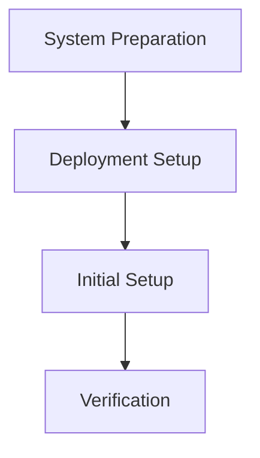
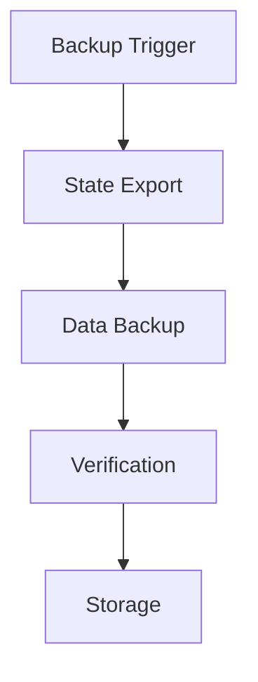
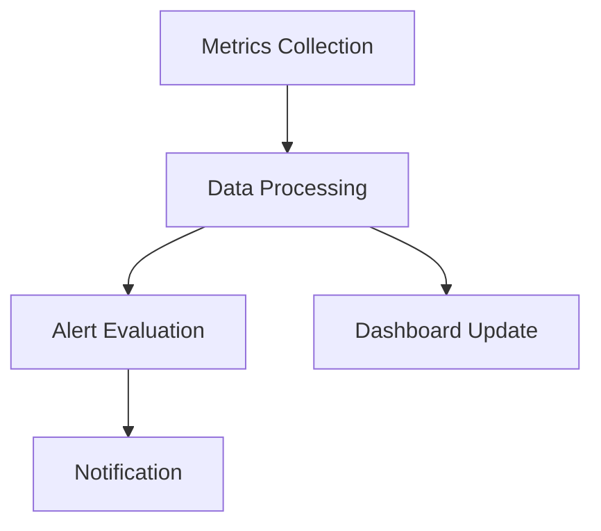

# Management System Design

## System Overview

The Management System is designed to provide a comprehensive solution for deploying, configuring, and maintaining systems across different environments. The system follows a modular architecture that allows for easy extension and customization.

## Core Components

1. **Deployment Management**
   - System preparation and dependency management
   - Deployment automation
   - Initial configuration and setup
   - Health checks and verification

2. **Backup System**
   - Automated data backups
   - Configuration state preservation
   - Data export
   - Secure backup storage
   - Backup verification and restoration
   - Retention policy management

3. **Monitoring & Alerting**
   - System metrics collection (CPU, memory, disk)
   - Performance tracking
   - Log aggregation
   - Alert configuration

4. **Security Management**
   - System hardening procedures
   - Network security configuration
   - Certificate management
   - Secrets handling
   - Access control policies
   - Audit logging

## System Architecture

### Component Organization
```
management-system/
├── src/
│   ├── core/           # Core system functionality
│   ├── deploy/         # Deployment management
│   ├── backup/         # Backup functionality
│   ├── monitor/        # Monitoring components
│   ├── security/       # Security management
│   └── config/         # Configuration management
├── config/             # Configuration files
│   ├── environments/   # Environment-specific configs
│   └── templates/      # Configuration templates
└── scripts/            # Utility scripts
```

### Configuration Management
- Environment-based configuration
- Secure secrets management
- Version-controlled configurations
- Configuration backup and restore

### State Management
- Deployment state tracking
- Configuration change monitoring
- System health tracking
- Backup state management

## Operational Workflows

### 1. Initial Deployment


### 2. Backup Process


### 3. Monitoring Flow


## Extension Points

1. **Custom Deployment Steps**
   - Pre-deployment actions
   - Post-deployment verification
   - Environment-specific setup

2. **Backup Strategies**
   - Custom backup locations
   - Additional backup items
   - Custom retention policies

3. **Monitoring Extensions**
   - Custom metrics
   - New alert conditions
   - Additional notification channels

4. **Security Modules**
   - Custom hardening steps
   - Additional security checks
   - Custom audit rules

## Best Practices

1. **Deployment**
   - Use incremental deployment steps
   - Implement proper rollback mechanisms
   - Verify each step before proceeding

2. **Security**
   - Follow the principle of least privilege
   - Regularly rotate secrets
   - Implement proper access controls
   - Monitor security events

3. **Monitoring**
   - Set up comprehensive logging
   - Configure meaningful alerts
   - Maintain historical metrics
   - Regular system health checks

4. **Maintenance**
   - Regular backup verification
   - System updates management
   - Performance optimization
   - Regular security audits